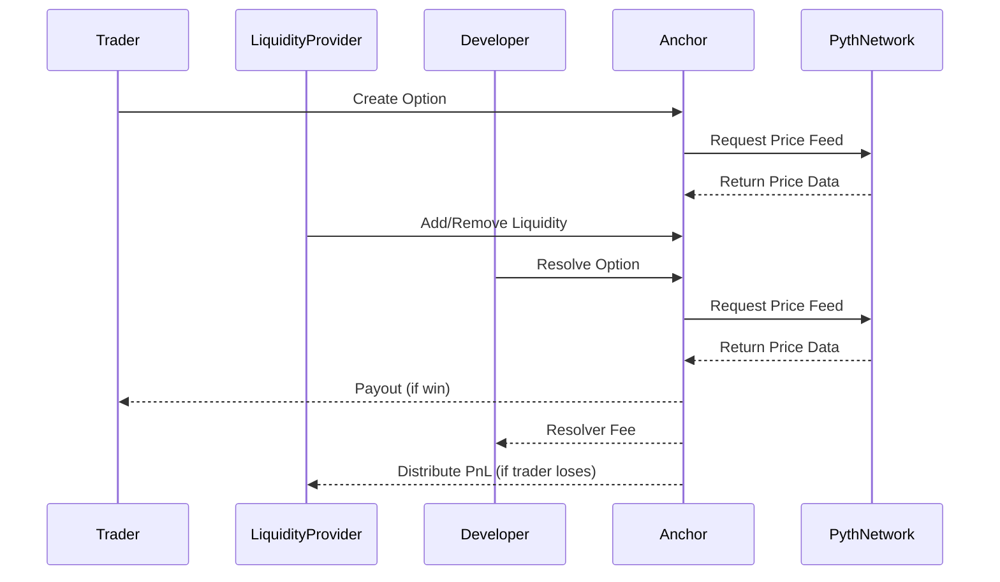

# Anchor Protocol

> **Quick Links:**  
> [Anchor UI](https://github.com/akbaridria/anchor-web)

**Anchor** is a fully decentralized, non-custodial protocol for options trading, designed to empower anyone to participate as a trader, liquidity provider, or developer. The protocol features on-chain settlement, locked liquidity for guaranteed payouts, and a scalable pull-based reward distribution system. Anchor ensures fair and transparent trading, robust liquidity safety, and efficient reward mechanisms for all participants. Price feeds and settlement data are secured by the Pyth Network oracle, enabling reliable and tamper-resistant market operations

## Features

1. **Locked Liquidity for Guaranteed Payouts**:
Liquidity is locked for each option, so winning traders are always paid out.

2. **Open Community Participation**:
    - **Traders:** Trade options to profit.
    - **Liquidity Providers:** Provide liquidity to earn a share of protocol profits.
    - **Developers:** Create scripts to resolve options and earn a 1% resolver fee of each option value.

3. **Efficient Pull-Based Liquidity Mechanism**:
When the trader loses an option, their funds are distributed to liquidity providers. Instead of a gas-wasting push model, Anchor uses a pull-based Batog algorithm (you can read more about it [here](https://batog.info/papers/scalable-reward-distribution.pdf)) that allows providers to claim rewards efficiently.

## Future Feature

1. **Liquidity Protection & Utilization Guard**:
   When the protocol's liquidity utilization rate exceeds 80%, trading is automatically suspended until enough liquidity is released, protecting everyone involved.

## Actors & Flow

